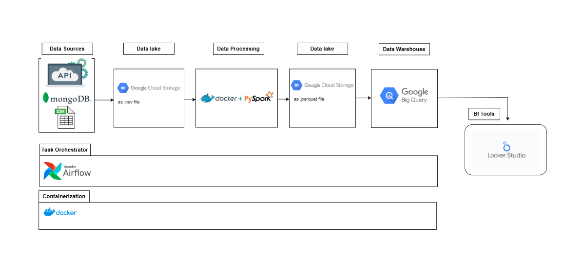
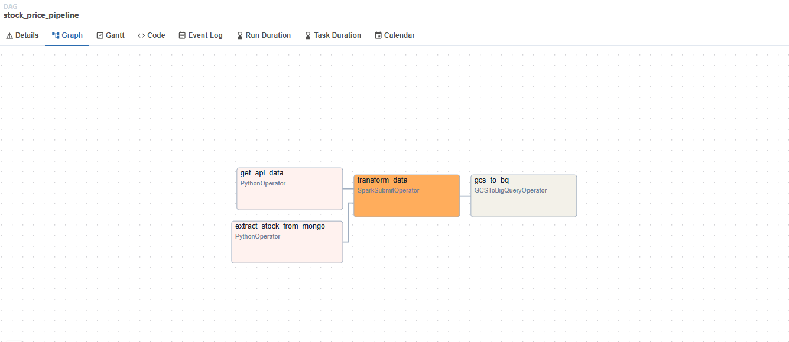
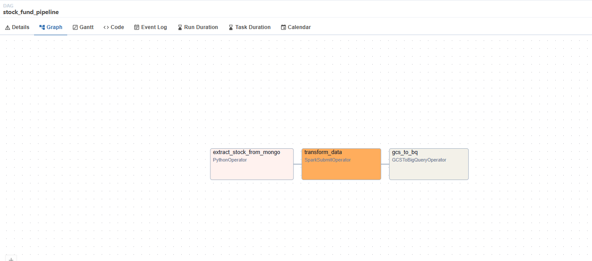

# Stock Pipeline: Airflow(Local) + Spark(Local) + GCP for Data Engineering
Chawalwit P.

## Overview of Project
This project demonstrates a complete Data Engineering Pipeline for processing historical stock and fundamental data.
It incorporates **Airflow** for orchestration, **PySpark** for data processing, and integrates with **Google Cloud Platform (GCP)** services such as **Google Cloud Storage (GCS)** and **BigQuery**.
The orchestration and data processing components (Airflow and Spark) are run locally using **Docker**.

## Tech stack of Project
1. Orchestration: Apache Airflow (local with Docker)
2. Data Processing: PySpark (local with Docker)
3. Cloud Services: Google Cloud Storage (GCS), BigQuery
4. Containerization: Docker
5. Visualization: Looker Studio
6. Data Source: MongoDB, CSV, and APIs

## Key Features of Project
- Data Extraction:
  - Extract stock prices and stock fundamentals from **MongoDB**.
  - Extract exchange rates from a **public API**.
  - Extract stock sector and details from a local **CSV file**.
  - Load the extracted data to Google Cloud Storage as raw files (CSV).
- Data Transformation:
  - Use **PySpark** (running locally in Docker) to clean and process data (e.g., merging and renaming columns).
  - Compute stock technical metrics, such as SMA (Simple Moving Average) and RSI (Relative Strength Index).
- Data Storage:
  - Save the processed data as **Parquet** files in **Google Cloud Storage**.
  - Load data into **BigQuery** for analysis.
- Visualization:
  - Build a dashboard in **Looker Studio** to analyze stock trends and fundamental trends, including revenue and gross profit.
  - Access the live dashboard here: [Looker Studio Dashboard](https://lookerstudio.google.com/reporting/bdbaa23a-ea17-4191-b641-5bb3315c3246).
- Orchestration:
  - Use Apache Airflow (running locally in Docker) to automate the pipeline and monitor tasks.
 
## Pipeline Architecture
- Step in the stock price Pipeline
  1. Extract:
      - Extract stock prices from **MongoDB**(using MongoHook), stock sectors from a CSV file, and exchange rates from a public API.
      - Store raw data in Google **Cloud Storage**.
  2. Transform:
      - Use PySpark to process the raw data (using the SparkSubmitOperator):
        - Clean the data by fixing dates, reformatting, renaming columns, and selecting useful columns.
        - Merge stock prices with sectors and drop unnecessary columns.
        - Compute the Simple Moving Average (SMA) and Relative Strength Index (RSI), and drop any preparation columns.
        - Save processed data to Google Cloud Storage in Parquet format.
  3. Load:
        - Load data from Parquet files into **BigQuery** for visualization using the **GCStoBigQueryOperator**.
  

- Step in the stock fund Pipeline
  1. Extract:
      - Extract stock funds from **MongoDB** (using MongoHook) and stock sectors from a CSV file. Store the raw data in **Google Cloud Storage**.
  2. Transform:
      - Clean the data by fixing dates, reformatting, renaming columns, and selecting useful columns.
      - Merge stock prices with sectors and drop unnecessary columns.
      - Save processed data to Google Cloud Storage in Parquet format.
  3. Load:
      - Load data from Parquet files into **BigQuery** for visualization using the **GCStoBigQueryOperator**.
  
